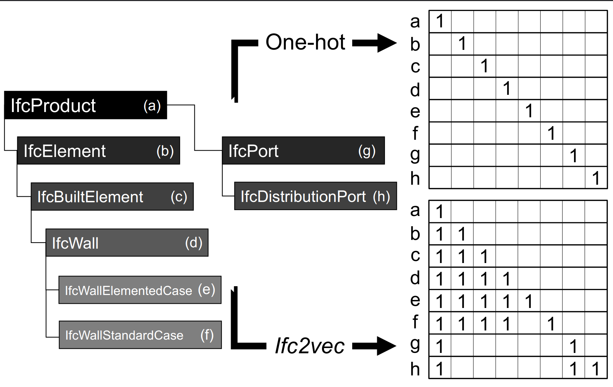

# IFC2vec


**IFC2vec** is a simple yet effective technique to convert the Industry Foundation Classes (IFC) hierarchical schema into a vector representation from [Semantic-aware quality assessment of building elements using graph neural networks](https://www.sciencedirect.com/science/article/pii/S092658052300314X). The vector representation can be used to perform similarity search, clustering, and other machine learning tasks.

## Overview

Most learning algorithms require numeric input variables, so categorical features must be transformed to numeric during pre-processing. One-hot encoding is a typical method to convert categorical features to one-hot vectors. This technique assumes that the feature categories are independent. However, the IFC schema follows a hierarchical class structure where each class has associations with others. Moreover, some IFC classes may be ambiguous if the context is overlooked. For instance, *IfcCovering* may be related to a ceiling, flooring, molding, or cladding. Therefore, the one-hot encoding of the interrelated classes in the IFC data model may be a naïve approach.

We introduce *ifc2vec*, a simple yet effective method to convert an IFC EXPRESS schema (e.g., IFC2X3) into a look-up dictionary, $ifc2vec: IfcClass \to {\mathbb{R}}^n $. Our *ifc2vec* is useful for encoding element types considering their semantic relationships in learning-based or data-mining tasks. We extract the hierarchical inheritance relationships between the IFC classes and represent them as a tree that we call *ancestors tree*. This is done using ifcOWL [[1](http://dx.doi.org/10.1016/j.autcon.2015.12.003.)], i.e., a Web Ontology Language (OWL) representation of the IFC schema. The root of the tree is the highest level in the IFC schema that one cares about. The children are classes that inherit from the parent class. For quality assessment purposes, *IfcProduct* is opted to be the root. By mapping a meaningful portion of the IFC to a tree, IFC classes can be represented as binary vectors indicating the path from the root to its node in the tree. For instance, sub-classes of *IfcWall*, siblings *IfcWallElementedCase* and *IfcWallStandardCase*, have closer vector embeddings in *ifc2vec* than dissimilar ones such as *IfcWallElementedCase* and *IfcDistributionPort* (Fig 1).



Fig 1. *A sub-tree in \textit{ancestors tree} and its one-hot and \textit{ifc2vec} encodings. In \textit{ifc2vec}, similar types are less distant than dissimilar ones ($\vec{e}.\vec{f} > \vec{e}.\vec{h}$), while in one-hot encoding, they are equally distant ($\vec{e}.\vec{f} = \vec{e}.\vec{h}$).*


If you use this code, please cite the following paper:

```
@article{KAYHANI2023105054,
title = {Semantic-aware quality assessment of building elements using graph neural networks},
journal = {Automation in Construction},
volume = {155},
pages = {105054},
year = {2023},
issn = {0926-5805},
doi = {https://doi.org/10.1016/j.autcon.2023.105054},
author = {Navid Kayhani and Brenda McCabe and Bharath Sankaran},
```
## Installation

### Using `pip` and `virtualenv`

To install the dependencies listed in the `requirements.txt` file, follow these steps:

1. Open a terminal window and navigate to the root directory of your project.
2. Create a new virtual environment by running `python -m venv env` in the terminal. This will create a new directory called `env` in your project directory.
3. Activate the virtual environment by running `source env/bin/activate` on macOS/Linux or `.\env\Scripts\activate` on Windows.
4. Install the dependencies by running `pip install -r requirements.txt` in the terminal. This will install all the packages listed in the `requirements.txt` file.
5. You can now run your project with the installed dependencies.

Note: If you add or remove packages from the `requirements.txt` file, you will need to re-run `pip install -r requirements.txt` to update the installed packages.

### Using `Conda`

Alternatively, you can use Conda to create a new environment and install the dependencies. Here are the steps:

1. Open a terminal window and navigate to the root directory of your project.
2. Create a new Conda environment by running `conda create --name myenv` in the terminal. This will create a new environment called `myenv`.
3. Activate the Conda environment by running `conda activate myenv` in the terminal.
4. Install the dependencies by running `conda install --file requirements.txt` in the terminal. This will install all the packages listed in the `requirements.txt` file.
5. You can now run your project with the installed dependencies.

Note: If you add or remove packages from the `requirements.txt` file, you will need to re-run `conda install --file requirements.txt` to update the installed packages.